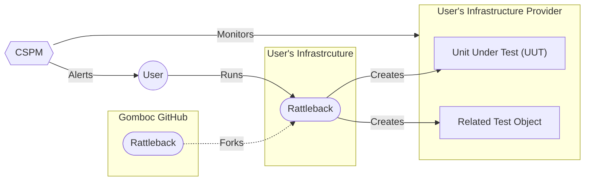
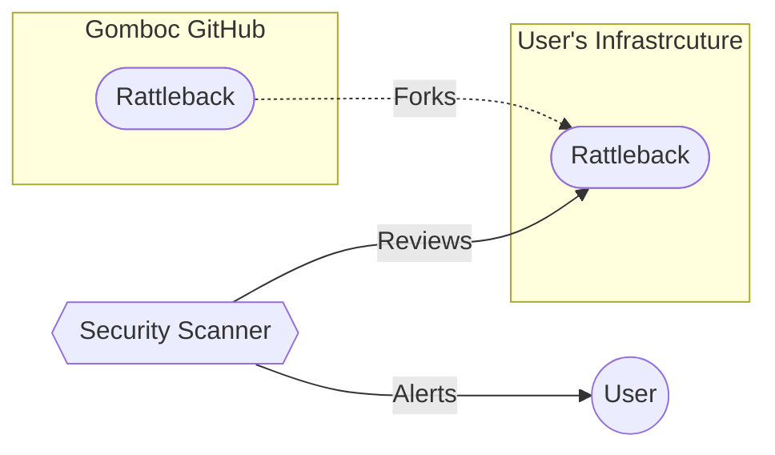

# Rattleback

A [Rattleback](https://en.wikipedia.org/wiki/Rattleback) is a geometric shape that will only spin in a single direction.  Any attempt to spin it in a direction other then the intended direction results in it becoming unstable until it spins in the correct direction.

This is an apt comparison to the ecosystem of security tools.  Some IaC is developed, which when spun up is inundated with security alerts making the DevOps' life unstable until the IaC is corrected and the fix applied.  This repository is an attempt to capture known bad configurations that should generate alerts.

## Use Cases

This repo is intended to be used in the following ways:

### CSPM / SIEM Testing

CSPMs and many tools in the security space actually check the final result of the IaC files.  Then then generally alert a human to decide how to remediate.

This repo is meant to be used in those cases as each test case is can be applied to an account (hopefully a lab account) and has a known set of issues.  A human can then compare these known issues against their policies and tooling to determine what the correct alerts should be.

### IaC Security Scanning Tool Testing

Security Scanning tools usually alert the user based on just scanning the code.  This use case can also make use of this repo with the caveate that there are going to be some cases we cannot represent because the code has to be able to be applied.

## Directory layout

In order to keep things organized the directory layout is as follows.

- `<provider>` - The infrastructure provider where the test-case can be applied.  Rarely if ever will there be a test case that spans providers.
    - `<tool>` - The tool needed to apply the test case (i.e., `terraform`).
        - `<test case>` - The test case itself.  The name should be hyphen delimited, and descriptive of the issue being created.

Each level can have a README.md that describes what is being done, and any pre-conditions (aside from the account) that are needed.

## Test Case

This repo is intended to be a realistic set of test cases.  Each test case is meant to be fully self-standing meaning that the unit under test is the only one that should have security issues.

If the tooling supports it, the unit under test should be call `uut` or should have a name, description, or tag that includes `uut` in some way.  The test-case name should also be included in all the rendered objects in some way so that they are easy to find after the fact; especially in cases of cleanup failures.

## Local Usage

This repo is meant to be run from within the dev-container, which contains all the tools needed.

### Sensitive info

Where possible we mount the correct local auth files like `~/.gcloud/` so that any local auth can be used on the container.  We also ignore the `./.env` file and `*.tfvars` so that you can use those - if needed - to house sensitive infomation.

## Resources

### *Goat

[Bridgecrew](https://github.com/bridgecrewio) used to actively maintain a series of "Goat" repos which housed invalid configurations that their tool `checkov` checked for. While the tool is still being maintained the "Goat" repos are not.

One major issue with the "Goat" repos is that because they were designed to be used by a static code tools they are not written in a realistic way.  This means that while all the code can be scanned, it often cannot be applied, and therefore not all remediations can actually be tested.
